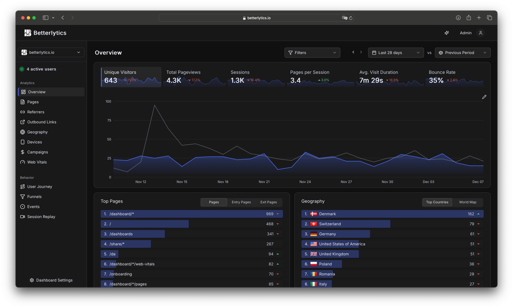
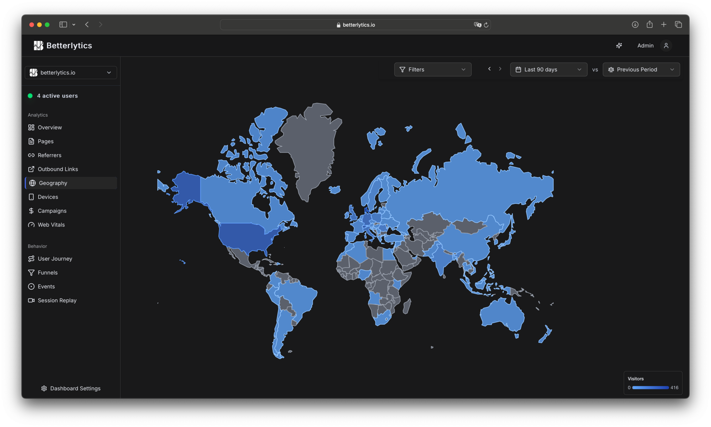
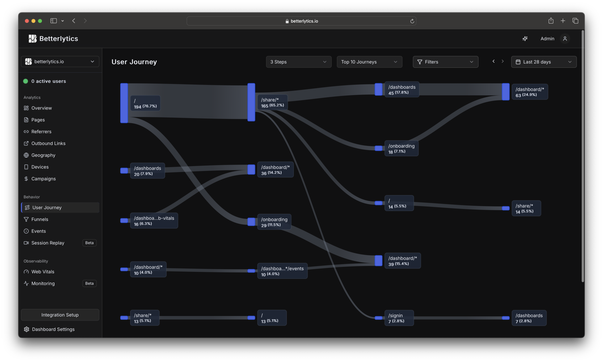
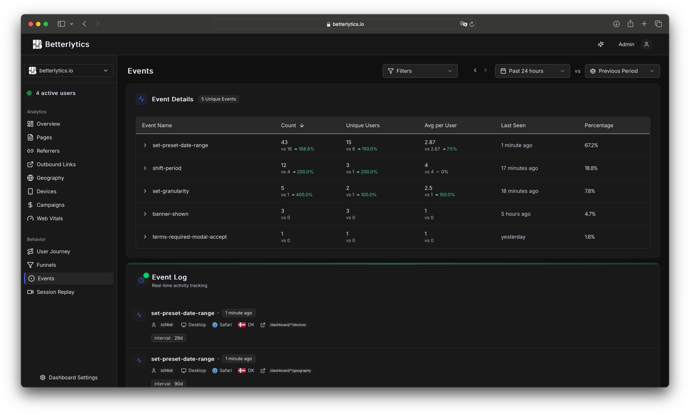
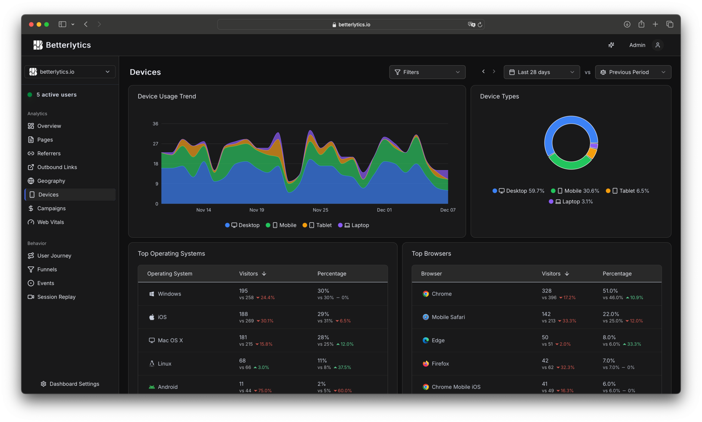
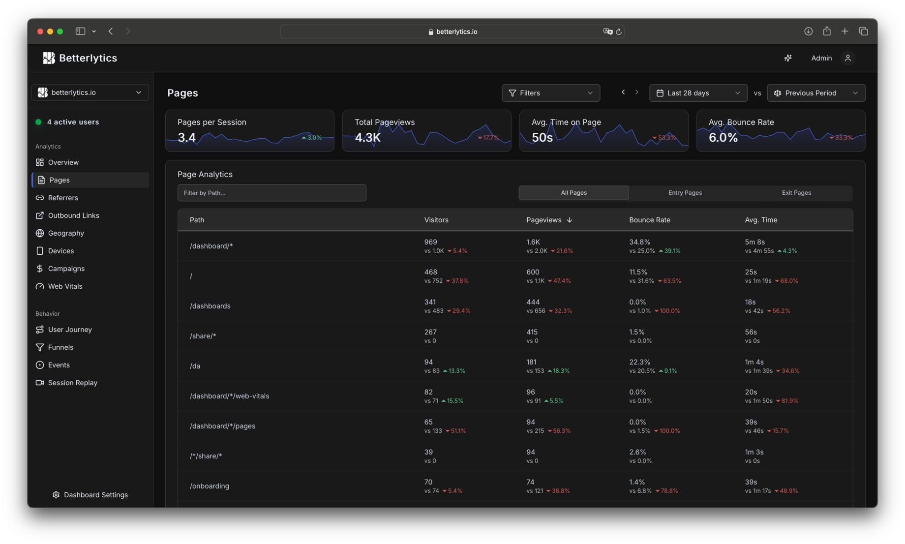

<picture>
  <source media="(prefers-color-scheme: dark)" srcset=".github/assets/betterlytics-logo-full-inline-light.svg">
  <source media="(prefers-color-scheme: light)" srcset=".github/assets/betterlytics-logo-full-inline-dark.svg">
  
</picture>

**A modern, Cookieless & privacy-focused analytics platform built for the future**

   

  

[Website](https://betterlytics.io) | [Demo](https://betterlytics.io/demo) | [Docs](https://betterlytics.io/docs) | [Features](https://betterlytics.io/features) | [Contribute](CONTRIBUTING.md)

---

## Why Betterlytics?

Betterlytics is a **high-performance, privacy-first** analytics platform that puts you in control of your data. Built with modern technologies like Rust and ClickHouse, it delivers lightning-fast insights while respecting user privacy.

**Our core principles:**

- **Privacy-First**: GDPR, CCPA, and PECR compliant with no third-party tracking
- **Cookieless**: No cookies required, respects user privacy
- **Lightning Fast**: Built on Rust and ClickHouse for maximum performance
- **Lightweight Tracking**: <2KB script with minimal impact on your website's performance
- **Modern UI**: Beautiful, responsive dashboard built with Next.js 15 and React 19
- **Scalable**: Handles millions of events with ease

### Complete Feature Set

| Category                   | Features                                                                                                                 |
| -------------------------- | ------------------------------------------------------------------------------------------------------------------------ |
| **Core Analytics**         | Page views, visitors, bounce rate, traffic sources, geographic insights, device analytics, real-time data, custom events |
| **Advanced Analytics**     | Session replay, user journeys, funnels, time period comparisons, annotations, outbound link tracking                     |
| **Performance Monitoring** | Core Web Vitals (LCP, INP, CLS, TTFB), uptime monitoring, SSL certificate monitoring                                     |
| **Privacy & Compliance**   | Cookieless tracking, GDPR/CCPA/PECR compliant, EU hosting, data anonymization, open source                               |
| **Access & Security**      | Role-based access control, two-factor authentication, OAuth (Google, GitHub)                                             |
| **Developer Experience**   | Simple script tag, framework SDKs (React, Next.js), self-hosting option, <2KB payload                                    |

**[View all features →](https://betterlytics.io/features)**

## Getting Started

Choose the option that works best for you:

<table>
<tr>
<td width="50%" valign="top">

### Cloud Hosting (Recommended)

Get started instantly with our free managed cloud service:

**[Start Free →](https://betterlytics.io/onboarding)**

- ✅ **Free forever plan** - No trial, genuinely free for small sites
- ✅ **No setup required** - Ready in 30 seconds
- ✅ **EU infrastructure** - All data processed on EU-owned cloud infrastructure
- ✅ **Automatic updates** - Always latest features
- ✅ **Managed infrastructure** - We handle scaling and maintenance
- ✅ **Team collaboration** - Role-based access control with members system
- ✅ **99.9% uptime** - Enterprise-grade reliability
- ✅ **Premium support** - Get help from our expert team
- ✅ **Automatic backups** - Your data is safe and recoverable
- ✅ **Paid plans available** - Scale up when you need more

</td>
<td width="50%" valign="top">

### Self-Hosting

Run Betterlytics on your own infrastructure for complete control and privacy.

**[Quick Setup Guide →](SETUP.md#quick-setup)**

- ✅ **Complete privacy** - Your data never leaves your servers
- ✅ **Full control** - Customize everything to your needs
- ✅ **No fees to us** - Your money goes to infrastructure providers
- ⚠️ **You manage everything** - Installation, maintenance, upgrades, security
- ⚠️ **Updates lag behind** - Cloud gets new features first
- ⚠️ **Your responsibility** - Server capacity, uptime, backups, loading times
- ⚠️ **Infrastructure costs** - Server, CDN, backups, and associated costs

**[Setup Guide](SETUP.md#quick-setup)** | **[Docker Setup](SETUP.md#docker-setup)** | **[Development](CONTRIBUTING.md)**

</td>
</tr>
</table>

---

## Dashboard Preview

### Overview

### Geography Insights

### User Journey Diagram

### Events and Live Event Insights

### Devices Breakdown

### Pages Breakdown

... and much more

## Ideas & Suggestions

Have an idea for Betterlytics? We'd love to hear it!

- Start a [discussion](https://github.com/betterlytics/betterlytics/discussions) to share ideas or ask questions
- Found a bug? [Open an issue](https://github.com/betterlytics/betterlytics/issues)
- Want to contribute code? Check out [CONTRIBUTING.md](CONTRIBUTING.md)

---

## License & Attribution

This project is licensed under the [AGPL-3.0 License](LICENSE).

### Third-Party Components

Betterlytics includes components from other open source projects. See [THIRD-PARTY-LICENSES.md](THIRD-PARTY-LICENSES.md) for detailed attribution and license information.

---

## Community

Join our small community of developers and privacy advocates:

- **[Discord](https://discord.gg/vwqSvPn6sP)** - Get help, share ideas, and connect with other users and developers
- **[Bluesky](https://bsky.app/profile/betterlytics.bsky.social)** - Follow us for updates and announcements
- **[GitHub Issues](https://github.com/betterlytics/betterlytics/issues)** - Report bugs and request features
- **[GitHub Discussions](https://github.com/betterlytics/betterlytics/discussions)** - Ask questions and share feedback
