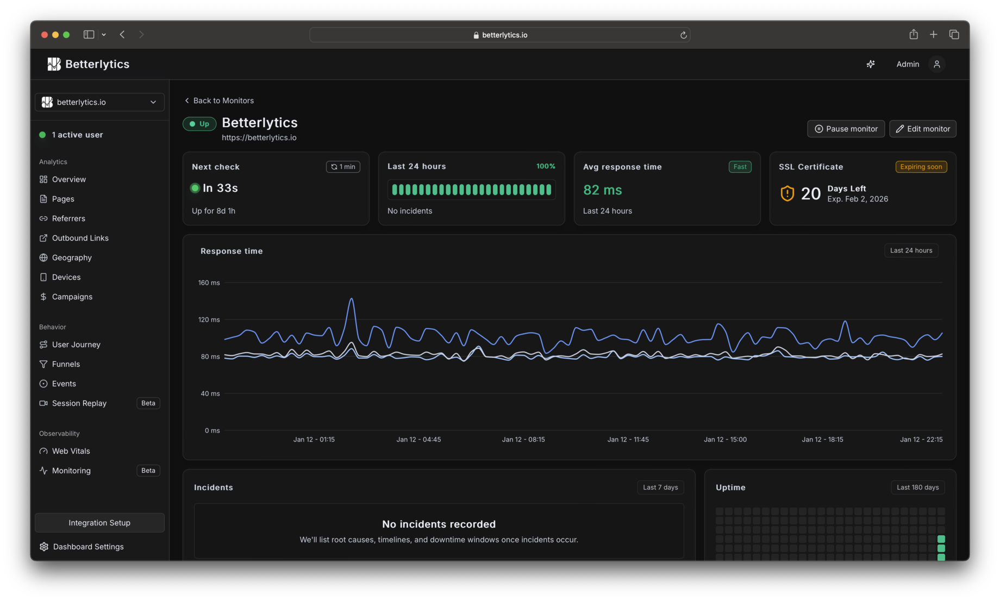

<picture>
  <source media="(prefers-color-scheme: dark)" srcset=".github/assets/betterlytics-logo-full-inline-light.svg">
  <source media="(prefers-color-scheme: light)" srcset=".github/assets/betterlytics-logo-full-inline-dark.svg">
  
</picture>

**A modern take on cookieless, privacy-focused web analytics**

 
      

[Website](https://betterlytics.io) | [Demo](https://betterlytics.io/demo) | [Docs](https://betterlytics.io/docs) | [Features](https://betterlytics.io/features) | [Contribute](CONTRIBUTING.md)

---

## Why Betterlytics?

Betterlytics is a high-performance analytics platform that puts you in control of your data. It requires no cookies, is GDPR/CCPA/PECR ready out of the box, and never shares data with third parties. Built on Rust and ClickHouse for speed, it delivers real-time insights through a modern dashboard, all with a tracking script under 2KB.

> **Want to see it in action?** Explore the [live demo](https://betterlytics.io/demo). No signup required.

### Features

| Category                   | Features                                                                                                                 |
| -------------------------- | ------------------------------------------------------------------------------------------------------------------------ |
| **Core Analytics**         | Page views, visitors, bounce rate, traffic sources, geographic insights, device analytics, real-time data, custom events |
| **Advanced Analytics**     | Session replay, user journeys, funnels, time period comparisons, annotations, outbound link tracking                     |
| **Performance Monitoring** | Core Web Vitals (LCP, INP, CLS, TTFB), uptime monitoring, SSL certificate monitoring                                     |
| **Privacy & Compliance**   | Cookieless tracking, GDPR/CCPA/PECR ready, EU hosting, data anonymization, open source                                   |
| **Access & Security**      | Role-based access control, two-factor authentication, OAuth (Google, GitHub)                                             |
| **Developer Experience**   | Simple script tag, framework SDKs (React, Next.js), self-hosting option, <2KB payload                                    |

**[View all features →](https://betterlytics.io/features)**

## Getting Started

Betterlytics can be used as a managed cloud service or self-hosted on your own infrastructure.

| | **Cloud** | **Self-Hosted** |
| --- | --- | --- |
| | [Get started free](https://betterlytics.io/signup) | [Setup guide](https://betterlytics.io/docs/installation/self-hosting) |
| **Setup** | Instant, ready in 30 seconds | Manual installation via Docker |
| **Infrastructure** | Managed by us (EU-based) | Managed by you |
| **Updates** | Automatic | Manual |
| **Data location** | EU cloud infrastructure | Your own servers |
| **Cost** | Free tier available, paid plans to scale | Your infrastructure costs only |
| **Support** | Included | Community |

**[Installation overview](https://betterlytics.io/docs/installation)**

---

## Dashboard Preview

### Overview

### Geography Insights

### User Journey Diagram

### Events and Live Event Insights

### Devices Breakdown

### Uptime & SSL Monitoring

... and much more

## Ideas & Suggestions

Have an idea for Betterlytics? We'd love to hear it!

- Start a [discussion](https://github.com/betterlytics/betterlytics/discussions) to share ideas or ask questions
- Found a bug? [Open an issue](https://github.com/betterlytics/betterlytics/issues)
- Want to contribute code? Check out [CONTRIBUTING.md](CONTRIBUTING.md)

---

## License & Attribution

This project is licensed under the [AGPL-3.0 License](LICENSE).

### Third-Party Components

Betterlytics includes components from other open source projects. See [THIRD-PARTY-LICENSES.md](THIRD-PARTY-LICENSES.md) for detailed attribution and license information.

---

## Community

Join our small community of developers and privacy advocates:

- **[Discord](https://discord.gg/vwqSvPn6sP)** - Get help, share ideas, and connect with other users and developers
- **[Bluesky](https://bsky.app/profile/betterlytics.bsky.social)** - Follow us for updates and announcements
- **[GitHub Issues](https://github.com/betterlytics/betterlytics/issues)** - Report bugs and request features
- **[GitHub Discussions](https://github.com/betterlytics/betterlytics/discussions)** - Ask questions and share feedback

---

If you find Betterlytics useful, consider giving it a star!

